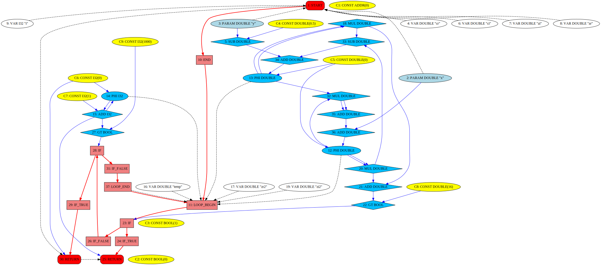

# IR - Lightweight JIT Compilation Framework

The main task of this framework is transformation of the IR (Intermediate
Representation) into an optimized in-memory target machine code, that may
be directly executed.

This is not a stable finished product yet. It’s used as a base for development
of the next generation JIT compiler for PHP-9. There are a lot of required
things are not implemented yet.

## IR - Intermediate Representation

The Framework uses single Medium level Intermediate Representation during all
phases of optimization, register allocation and code generation. It is inspired
by Sea-Of-Nodes introduced by Cliff Click [1]. Sea-Of-Nodes is used in Java
HotSpot Server Compiler, V8 TurboFan JavaScript Compiler, Java Graal
Compiler...

This representation unifies data and control dependencies into a single graph,
where each instruction represented as a Node and each dependency as an Edge
between Nodes. There are no classical CFG (Control Flow Graph) with Basic
Blocks. Instead, IR uses special Control Nodes that start and finish some
code Regions. The data part of the IR is very similar to SSA (Static Single
Assignment) form. Each variable may be assigned only once, but except to SSA,
in our IR, we don’t have any variables, their versions and name. Everything
is represented by computation Nodes and Edges between them. Of course, we
have special PHI Node that represents the Phi() function.

Despite, our IR is graph based, internally, it’s represented as a plain
two-way grow-able array of Nodes. Dependency Edge are represented as indexes
of the other Node. This physical representation is almost completely repeats
the LuaJIT IR designed by Mike Pall [3].

## IR Generation

TODO...
 
## IR Optimization

In comparison to classical optimizing compilers (like GCC and LLVM), IR
Framework uses very short optimization pipeline. Together with compact IR
representation, this makes it extremely fast and allows to generate quite
good machine code in reasonable time. 

### Folding

Folding is done on the fly, during IR generation. It performs a set of local
transformations, but because of the graph nature of the IR where most data
operations (like ADD) are “floating” (not “pinned” to Basic Block), the scope
of transformations is not limited by Basic Block. It’s important to generate
IR in a proper (Reverse Post) order, that would emit all Nodes before their
first usage. (In case of different order the scope of the folding should be
limited).

Folding Engine performs Constants Folding, Copy Propagation, Algebraic
Simplifications, Algebraic Re-Association and Common Sub-Expression
Elimination. The simple and fast declarative implementation is borrowed from
LuaJIT [3].
 
### Sparse Conditional Constant Propagation

This pass implements a classical algorithm originally designed by M. N. Wegman
and F. K. Zadeck [4] for SSA form. Unification of data and control dependencies
made its implementation even simple. Despite of constant propagation itself
this pass also performs global Copy Propagation and re-applies the folding rules.
At the end all the “dead” instructions (instructions that result are not used)
are replaced with NOPs.

### Global Code Motion

Now we have to “fix” places of “floating” instructions. This pass builds CFG
(Control Flow Graph) skeleton and then ”pin” each “floating” instruction to the
best Basic Block. The algorithm is developed by Cliff Click [2].

## Local Scheduling

As the final IR transformation pass, we reorder instructions inside each Basic
Block to satisfy the dependencies. Currently this is done by a simple
topological sorting.

## Target Instruction Selection

This is the first target dependent step of compilation. It aims to combine
instruction Nodes into tiles that allows better instruction fusion. For example
``10 + a + b * 4`` may be calculated by a single x86 instruction
``lea 10(%eax, %ebx, 4), %ecx``. The selection is done by a constrained tree
pattern matching. The current implementation uses simple Max-Munch approach.
(This may be replaced by a smarter BURS method).

## Register Allocation

CPU independent implementation of Linear Scan Register Allocation for SSA form
with second chance bin-packing. [5] [6]

## Machine Code Generations

IR Framework implements X86_64, x86 and AAtch64 back-ends. The current
implementation uses DynAsm [?]. (In the future, this should be replaced with
a faster “binary” encoder). Code generator walks throw all instructions of each
basic blocks and emits some code according to “rules” selected during
instruction selection pass. It uses registers, selected by register allocator
and inserts the necessary spill load/store and SSA deconstruction code.

## Tooling

- Ability to load and save IR in a textual form
- Ability to visualize IR graph through graphviz dot.
- Target CPU disassembler for generated code (uses libcapstone [?])
- GDB/JIT interface to allow debugging of JIT-ed code
- Linux perf interface to analyze the code performance

## IR Example

Let's try to generate code for the following function:

```c
int32_t mandelbrot(double x, double y)
{
	double cr = y - 0.5;
	double ci = x;
	double zi = 0.0;
	double zr = 0.0;
	int i = 0;

	while(1) {
		i ++;
		double temp = zr * zi;
		double zr2 = zr * zr;
		double zi2 = zi * zi;
		zr = zr2 - zi2 + cr;
		zi = temp + temp + ci;
		if (zi2 + zr2 > 16)
			return i;
		if (i > 1000)
			return 0;
	}
	
}
```

This may be done through IR construction API by the following code: 

```c
void gen_mandelbrot(ir_ctx *ctx)
{
	ir_ref start = ir_emit0(ctx, IR_START);
	ir_ref ret;

	ir_ref x_1 = ir_param(ctx, IR_DOUBLE, start, "x", 0);
	ir_ref y_1 = ir_param(ctx, IR_DOUBLE, start, "y", 1);

	ir_ref cr = ir_var(ctx, IR_DOUBLE, start, "cr");
	ir_ref cr_1 = ir_fold2(ctx, IR_OPT(IR_SUB, IR_DOUBLE), y_1,
		ir_const_double(ctx, 0.5));
	ir_ref ci = ir_var(ctx, IR_DOUBLE, start, "ci");
	ir_ref zi = ir_var(ctx, IR_DOUBLE, start, "zi");
	ir_ref zr = ir_var(ctx, IR_DOUBLE, start, "zr");
	ir_ref i = ir_var(ctx, IR_I32, start, "i");

	ir_ref e_1 = ir_emit1(ctx, IR_END, start);
	ir_ref l_1 = ir_emit1(ctx, IR_LOOP_BEGIN, e_1);

	ir_ref zi_1 = ir_emit2(ctx, IR_OPT(IR_PHI, IR_DOUBLE), l_1,
		ir_const_double(ctx, 0.0));
	ir_ref zr_1 = ir_emit2(ctx, IR_OPT(IR_PHI, IR_DOUBLE), l_1,
		ir_const_double(ctx, 0.0));
	ir_ref i_1 = ir_emit2(ctx, IR_OPT(IR_PHI, IR_I32), l_1,
		ir_const_i32(ctx, 0));
	ir_ref i_2 = ir_emit2(ctx, IR_OPT(IR_ADD, IR_I32), i_1,
		ir_const_i32(ctx, 1));
	ir_ref temp = ir_var(ctx, IR_DOUBLE, l_1, "temp");
	ir_ref temp_1 = ir_fold2(ctx, IR_OPT(IR_MUL, IR_DOUBLE), zr_1, zi_1);
	ir_ref zr2 = ir_var(ctx, IR_DOUBLE, l_1, "zr2");
	ir_ref zr2_1 = ir_fold2(ctx, IR_OPT(IR_MUL, IR_DOUBLE), zr_1, zr_1);
	ir_ref zi2 = ir_var(ctx, IR_DOUBLE, l_1, "zi2");
	ir_ref zi2_1 = ir_fold2(ctx, IR_OPT(IR_MUL, IR_DOUBLE), zi_1, zi_1);
	ir_ref zr_2 = ir_fold2(ctx, IR_OPT(IR_ADD, IR_DOUBLE),
		ir_fold2(ctx, IR_OPT(IR_SUB, IR_DOUBLE), zr2_1, zi2_1),
		cr_1);
	ir_ref zi_2 = ir_fold2(ctx, IR_OPT(IR_ADD, IR_DOUBLE),
		ir_fold2(ctx, IR_OPT(IR_ADD, IR_DOUBLE), temp_1, temp_1),
		x_1);

	ir_ref if_1 = ir_emit2(ctx, IR_IF, l_1,
		ir_fold2(ctx, IR_OPT(IR_GT, IR_BOOL),
			ir_fold2(ctx, IR_OPT(IR_ADD, IR_DOUBLE), zi2_1, zr2_1),
			ir_const_double(ctx, 16.0)));

	ir_ref r_1 = ir_emit1(ctx, IR_IF_TRUE, if_1);
	ret = ir_emit2(ctx, IR_OPT(IR_RETURN, IR_I32), r_1, i_2);

	ir_ref r_2 = ir_emit1(ctx, IR_IF_FALSE, if_1);

	ir_ref if_2 = ir_emit2(ctx, IR_IF, r_2,
		ir_fold2(ctx, IR_OPT(IR_GT, IR_BOOL), i_2, ir_const_i32(ctx, 1000)));

	ir_ref r_3 = ir_emit1(ctx, IR_IF_TRUE, if_2);

	ret = ir_emit3(ctx, IR_OPT(IR_RETURN, IR_I32), r_3, ir_const_i32(ctx, 0), ret);

	ir_ref r_4 = ir_emit1(ctx, IR_IF_FALSE, if_2);

	ir_ref l_2 = ir_emit2(ctx, IR_LOOP_END, r_4, l_1);

	ir_set_op2(ctx, l_1, l_2);
	ir_set_op3(ctx, zi_1, zi_2);
	ir_set_op3(ctx, zr_1, zr_2);
	ir_set_op3(ctx, i_1, i_2);

	ir_set_op1(ctx, start, ret);
}
```
The textual representation of the IR after system independent optimizations:

```
{
	uintptr_t c_1 = 0;
	bool c_2 = 0;
	bool c_3 = 1;
	double c_4 = 0.5;
	double c_5 = 0;
	int32_t c_6 = 0;
	int32_t c_7 = 1;
	double c_8 = 16;
	int32_t c_9 = 1000;
	l_1 = START(l_30);
	double d_2 = PARAM(l_1, "x", 0);
	double d_3 = PARAM(l_1, "y", 1);
	double d_4 = VAR(l_1, "cr");
	double d_5 = SUB(d_3, c_4);
	double d_6 = VAR(l_1, "ci");
	double d_7 = VAR(l_1, "zi");
	double d_8 = VAR(l_1, "zr");
	int32_t d_9 = VAR(l_1, "i");
	l_10 = END(l_1);
	l_11 = LOOP_BEGIN(l_10, l_37);
	double d_12 = PHI(l_11, c_5, d_36);
	double d_13 = PHI(l_11, c_5, d_34);
	int32_t d_14 = PHI(l_11, c_6, d_15);
	int32_t d_15 = ADD(d_14, c_7);
	double d_16 = VAR(l_11, "temp");
	double d_17 = VAR(l_11, "zr2");
	double d_18 = MUL(d_13, d_13);
	double d_19 = VAR(l_11, "zi2");
	double d_20 = MUL(d_12, d_12);
	double d_21 = ADD(d_20, d_18);
	bool d_22 = GT(d_21, c_8);
	l_23 = IF(l_11, d_22);
	l_24 = IF_TRUE(l_23);
	l_25 = RETURN(l_24, d_15);
	l_26 = IF_FALSE(l_23);
	bool d_27 = GT(d_15, c_9);
	l_28 = IF(l_26, d_27);
	l_29 = IF_TRUE(l_28);
	l_30 = RETURN(l_29, c_6, l_25);
	l_31 = IF_FALSE(l_28);
	double d_32 = MUL(d_12, d_13);
	double d_33 = SUB(d_18, d_20);
	double d_34 = ADD(d_33, d_5);
	double d_35 = ADD(d_32, d_32);
	double d_36 = ADD(d_35, d_2);
	l_37 = LOOP_END(l_31, l_11);
}
```
The visualized graph:



The final generated code:

```asm
test:
	subsd .L4(%rip), %xmm1
	xorpd %xmm3, %xmm3
	xorpd %xmm2, %xmm2
	xorl %eax, %eax
.L1:
	leal 1(%rax), %eax
	movapd %xmm2, %xmm4
	mulsd %xmm2, %xmm4
	movapd %xmm3, %xmm5
	mulsd %xmm3, %xmm5
	movapd %xmm5, %xmm6
	addsd %xmm4, %xmm6
	ucomisd .L5(%rip), %xmm6
	ja .L2
	cmpl $0x3e8, %eax
	jg .L3
	mulsd %xmm2, %xmm3
	subsd %xmm5, %xmm4
	movapd %xmm4, %xmm2
	addsd %xmm1, %xmm2
	addsd %xmm3, %xmm3
	addsd %xmm0, %xmm3
	jmp .L1
.L2:
	retq
.L3:
	xorl %eax, %eax
	retq
.rodata
.L4:
	.db 0x00, 0x00, 0x00, 0x00, 0x00, 0x00, 0xe0, 0x3f
.L5:
	.db 0x00, 0x00, 0x00, 0x00, 0x00, 0x00, 0x30, 0x40
```

## References

1. C. Click, M. Paleczny. “A Simple Graph-Based Intermediate Representation” In ACM SIGPLAN Workshop on Intermediate Representations (IR '95), pages 35-49, Jan. 1995.
2. C. Click. “Global Code Motion Global Value Numbering” In ACM SIGPLAN Notices, Volume 30, Issue 6, pp 246–257, June 1995
3. M. Pall. “LuaJIT 2.0 intellectual property disclosure and research opportunities” November 2009 http://lua-users.org/lists/lua-l/2009-11/msg00089.html
4.  M. N. Wegman and F. K. Zadeck. "Constant propagation with conditional branches" ACM Transactions on Programming Languages and Systems, 13(2):181-210, April 1991
5. C. Wimmer. “Optimized Interval Splitting in a Linear Scan Register Allocator” In VEE '05: Proceedings of the 1st ACM/USENIX international conference on Virtual execution environments, pages 132–141, June 2005
6. C. Wimmer and M. Franz. “Linear Scan Register Allocation on SSA Form” In CGO '10: Proceedings of the 8-th annual IEEE/ACM international symposium on Code generation and optimization, pages 170–179,  April 2010
